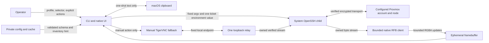

# RustedOutClient Threat Model

This document models the unreleased macOS ARM64 Proxmox console client at the
repository head containing this file. It describes code-established controls,
deployment assumptions, attacker hypotheses, open questions, and residual risk;
it does not assert that live acceptance has passed.

The review was performed sequentially by the sole Task 14A implementation
agent. It is source-backed but is not an independent second-party review.

## 1. Overview

RustedOutClient turns a validated local profile and live Proxmox inventory item
into an owned system-OpenSSH process, carries RFB over the child's standard
streams, and renders bounded framebuffer updates in a native egui workspace. A
separate, explicit fallback may snapshot a configured TigerVNC executable and
relay one loopback connection to the same verified SSH proxy.

### Components and sources

| Component | Security role | Primary source evidence |
| --- | --- | --- |
| Profile/configuration | Validates the stored schema, SSH target, node, VM IDs, private modes, and atomic replacement | `src/config.rs:20-40`, `src/config.rs:93-125`, `src/model.rs:24-35`, `src/model.rs:65-79`, `src/model.rs:109-115`, `src/config.rs:161-180`, `src/config.rs:200-225` |
| CLI and GUI | Admit only semantic inventory/session actions and a narrow host clipboard adapter | `src/cli.rs:23-89`, `src/session/events.rs:53-86`, `src/app/actions.rs:86-125`, `src/app/actions.rs:127-150` |
| SSH transport | Pins system OpenSSH, public-key-only authentication and strict trust options, reviewed command shapes, and exact owned child lifecycles | `src/ssh/command.rs:20-33`, `src/ssh/command.rs:53-73`, `src/ssh/command.rs:90-203`, `src/ssh/master.rs:196-275`, `src/ssh/stream.rs:824-960` |
| Proxmox proxy ticket | Generates a short-lived eight-byte OS-CSPRNG secret, keeps it redacted, and couples it to a live revalidated VM | `src/ssh/proxy.rs:20-105`, `src/ssh/proxy.rs:122-188` |
| Native RFB | Requires `TrustedSshProxy`, permits only VNC Auth type 2, bounds parsing/allocation, and owns bounded queues | `src/vnc/client.rs:591-664`, `src/vnc/security.rs:122-187`, `src/vnc/limits.rs:3-41`, `src/connection.rs:8-9`, `src/connection.rs:118-135` |
| Framebuffer/UI delivery | Bounds RGBA allocation and keeps pixel-bearing uploads out of `Debug`/`Display` | `src/vnc/limits.rs:53-100`, `src/app/state.rs:107-158`, `src/app/state.rs:161-223` |
| Clipboard | Defaults off, requires an explicit direction-specific action, enforces one MiB, and retains at most one one-shot remote value | `src/config.rs:77-90`, `src/app/actions.rs:291-337`, `src/vnc/input.rs:8-74`, `src/vnc/input.rs:225-253`, `src/connection.rs:70-101` |
| Dynamic Resolution | Normalizes backing pixels, debounces 250 ms, permits one in-flight request, and classifies bounded outcomes | `src/vnc/client.rs:198-235`, `src/session/manager.rs:45-50`, `src/session/manager.rs:337-435`, `src/session/manager.rs:700-785`, `src/session/manager.rs:942-1039` |
| Manual TigerVNC fallback | Owns one loopback listener, private viewer/password snapshots, fixed arguments/environment, relay, and cleanup | `src/fallback/relay.rs:32-34`, `src/fallback/relay.rs:49-82`, `src/fallback/mod.rs:241-297`, `src/fallback/mod.rs:333-485`, `src/fallback/mod.rs:499-540`, `src/fallback/password_file.rs:146-235` |
| Supply chain/CI | Restricts the supported target, sources, licenses, duplicates, toolchain, fail-closed audit exception, tests, and source policies; checkout is SHA-pinned without persisted credentials | `deny.toml:1-59`, `.github/workflows/ci.yml:16-129` |

### Effective resources and ownership

| Resource | Effective lifetime and owner | Security consequence |
| --- | --- | --- |
| Configuration and inventory cache | Private application directory; mode-0600 files replaced through private temporary files and atomic rename | Persistent non-secret topology still reveals private infrastructure and must remain user-private (`src/config.rs:200-225`, `src/cache.rs:67-120`) |
| SSH control socket/runtime directory | One process-owned mode-0700 temporary directory under `/tmp`; removed by `TempDir` | Keeps socket paths short/private but does not protect against compromise of the same user (`src/runtime.rs:11-40`) |
| SSH master, inventory, and proxy children | Exact child handles with bounded wait/kill/reap/drain paths | Prevents broad process killing and makes cleanup failure explicit (`src/ssh/master.rs:218-275`, `src/ssh/master.rs:332-404`, `src/ssh/stream.rs:824-960`) |
| VNC proxy ticket | The Rust-owned `ProxyTicket` is transferred into native VNC authentication or consumed by explicit fallback password-file creation; the native path drops its Rust owner before waiting for `SecurityResult` (`src/ssh/proxy.rs:25-105`, `src/vnc/security.rs:266-279`, `src/fallback/mod.rs:345-364`). The system OpenSSH proxy child is spawned with an `LC_PVE_TICKET` environment copy (`src/ssh/command.rs:53-68`, `src/ssh/stream.rs:869-960`). | Same-user process inspection remains a residual risk. A Rust drop cannot erase another process's environment. The OpenSSH copy is not observed to persist, but because earlier erasure is unproved, it is conservatively treated as potentially present until that exact owned proxy child exits. |
| Framebuffer and clipboard | Process memory only; framebuffer events are bounded/coalesced and remote clipboard is one replacing slot | Local memory compromise can disclose content despite no persistence (`src/app/state.rs:107-158`, `src/connection.rs:70-101`) |
| Fallback viewer/password artifacts | Mode-0500 executable snapshot and mode-0600 obfuscated password file inside the private runtime; one fallback owner | Temporary on-disk material exists only for the explicit fallback and must be cleaned on every path (`src/fallback/viewer.rs:146-238`, `src/fallback/password_file.rs:146-293`) |
| Fallback listener | One ephemeral IPv4 loopback listener, dropped after the first accept | Local same-host processes can race to connect; peer loopback checks and VNC Auth mitigate but do not create a sandbox (`src/fallback/relay.rs:32-34`, `src/fallback/relay.rs:63-101`) |

### Trust-boundary diagram

The OpenSSH host-verification boundary is between the app and the configured
node. The malicious-protocol boundary is between Proxmox-controlled RFB bytes
and the native parser. The local-content boundary is between framebuffer or
clipboard memory and the UI/OS. The fallback adds a same-host loopback boundary.

## 2. Threat Model, Trust Boundaries, and Assumptions

### Protected assets

- OpenSSH private-key/agent capability and known-hosts trust state. The app must
  use them without reading, copying, weakening, or persisting them.
- The process-local Proxmox VNC ticket and its VNC challenge-response material.
- Guest framebuffer pixels, typed input, clipboard text, VM identity, private
  profile targeting, and inventory/cache topology.
- Integrity of the selected VM, command allowlist, view-only state, dynamic
  resolution target, session ownership, and cleanup evidence.
- Availability of the desktop process in the face of malformed or adversarial
  SSH, inventory, RFB, decoder, queue, and fallback behavior.
- Release integrity: dependency source/license/advisory policy and exact-head CI
  results.

### Actors and capabilities

1. **Remote RFB/Proxmox attacker.** A compromised node or account can return
   arbitrary inventory records, RFB bytes, framebuffer dimensions, compressed
   payloads, clipboard text, resize replies, timing, and disconnect behavior.
   It is not assumed to control local source or the operator's known-hosts file.
2. **Network attacker.** Can intercept or redirect traffic but should be stopped
   by strict OpenSSH host verification and encryption. VNC Auth alone provides
   no confidentiality.
3. **Local same-user attacker.** May race user-owned files/loopback connections
   or inspect process memory. Mode bits and atomic open/rename controls reduce
   accidental or cross-user access; they do not claim isolation from an already
   compromised login session.
4. **Supply-chain attacker.** May try to introduce a vulnerable, yanked,
   wildcard, Git, unknown-registry, unlicensed, or unexpectedly duplicated
   dependency, or weaken CI/source policy.
5. **Operator error.** May choose the wrong profile/VM, establish trust for the
   wrong host outside the app, enable clipboard, disable view-only, or manually
   invoke fallback without understanding its temporary lower-assurance status.

### Code-established trust boundaries and controls

- **Operator/profile/CLI/UI.** SSH targets cannot begin with `-` or contain
  whitespace/control bytes; nodes and VM IDs have explicit grammars and ranges
  (`src/model.rs:24-35`, `src/model.rs:65-79`, `src/model.rs:109-115`). CLI
  surfaces only `list`, `open`, and `probe`, with native or explicit TigerVNC
  selection and no endpoint/ticket/password flags (`src/cli.rs:23-89`). The UI
  sends semantic app/session actions through nonblocking bounded sinks
  (`src/app/actions.rs:80-97`, `src/session/events.rs:33-86`).
- **OpenSSH trust and command execution.** Production is pinned to
  `/usr/bin/ssh`; strict host verification, batch mode, and public-key-only
  authentication are fixed. GSSAPI, hostbased, password, and keyboard-
  interactive authentication are disabled (`src/ssh/command.rs:20-33`,
  `src/ssh/command.rs:96-115`). Local process creation uses separate program,
  argument, and environment values, clears inherited `LC_PVE_TICKET`, and never
  invokes a local command interpreter (`src/ssh/command.rs:35-73`). Only control
  master/check/exit, read-only `pvesh` inventory, and `qm vncproxy <validated
  VMID>` shapes are produced (`src/ssh/command.rs:105-203`).
- **Ticket/environment.** A ticket is generated only after exact master recheck,
  live inventory lookup, and running-state validation; it is passed as the one
  approved `LC_PVE_TICKET` value and not in argv (`src/ssh/proxy.rs:141-188`,
  `src/ssh/command.rs:135-156`). Its type omits clone/display/serialization and
  redacts `Debug` (`src/ssh/proxy.rs:25-105`).
- **RFB trust.** The production VNC entry point requires the private-state
  `TrustedSshProxy`, not an arbitrary socket (`src/vnc/client.rs:591-664`). Only
  security type 2 is accepted; unsupported offerings fail with the security
  allowlist error (`src/vnc/security.rs:122-187`). Challenge, key, DES blocks,
  and response buffers are zeroized around authentication
  (`src/vnc/security.rs:189-236`).
- **Parser/resources.** Global ceilings are 8,192 per dimension, 33,554,432
  pixels, 134,217,728 RGBA bytes, 65,536 text bytes, 4,096 rectangles,
  67,108,864 encoded-rectangle bytes, and 1,048,576 clipboard bytes; a caller
  may tighten but not relax them (`src/vnc/limits.rs:3-41`). Declared byte
  lengths are checked before fallible allocation and exact read
  (`src/vnc/wire.rs:121-189`). Inventory stdout is capped at 4 MiB and captured
  stderr at 64 KiB (`src/ssh/inventory.rs:22-26`,
  `src/ssh/inventory.rs:226-250`). Public SSH/RFB errors retain categories and
  static fields, not raw remote data (`src/ssh/error.rs:5-64`,
  `src/vnc/wire.rs:39-119`).
- **Queues/pixels.** Each VNC command/event queue and the app queue has capacity
  256 (`src/connection.rs:8-9`, `src/connection.rs:118-135`,
  `src/session/manager.rs:45-50`). Pixel-bearing uploads implement neither
  `Debug` nor `Display`, while framebuffer debug output exposes dimensions,
  byte count, and revision only (`src/app/state.rs:107-158`).
- **Clipboard.** Configuration defaults clipboard off (`src/config.rs:77-90`).
  Sending reads the system clipboard only after explicit Send; receiving takes
  one buffered value only after explicit Receive (`src/app/actions.rs:291-323`,
  `src/vnc/input.rs:225-253`). Both directions enforce the one-MiB ceiling and
  remote text must be valid UTF-8 (`src/vnc/input.rs:36-74`,
  `src/vnc/client.rs:1124-1151`).
- **Dynamic Resolution.** UI logical points are multiplied by the native scale
  to obtain backing pixels (`src/app/view.rs:887-898`). Requests must be between
  640x480 and the framebuffer ceilings and round each axis down to a multiple of
  eight (`src/vnc/client.rs:198-235`). A 250 ms debounce, one in-flight slot,
  newest pending replacement, two-second deadline, and explicit failure states
  limit storms (`src/session/manager.rs:45-50`,
  `src/session/manager.rs:337-435`, `src/session/manager.rs:942-1039`). Fit is a
  local rendering mode and remains independent of the guest response
  (`src/app/view.rs:1014-1033`).
- **Fallback.** It is admitted only by explicit semantic command and configured
  viewer presence (`src/app/actions.rs:219-237`,
  `src/session/manager.rs:599-615`). The executable is opened, bounded to 64 MiB,
  copied to a mode-0500 private snapshot, and launched with a cleared, fixed
  environment (`src/fallback/viewer.rs:146-194`,
  `src/fallback/viewer.rs:246-303`, `src/fallback/mod.rs:241-297`). It uses one
  `127.0.0.1:0` listener, a mode-0600 eight-byte obfuscated password file, fixed
  VncAuth/RemoteResize/Shared arguments, and a single accepted loopback peer
  (`src/fallback/relay.rs:32-34`, `src/fallback/relay.rs:63-101`,
  `src/fallback/password_file.rs:146-235`, `src/fallback/mod.rs:520-540`).
- **Cleanup.** Native close releases keys before a bounded transport close,
  preserves primary-vs-cleanup truth, joins or aborts the exact VNC task, and
  clears the clipboard (`src/session/manager.rs:1052-1085`,
  `src/session/manager.rs:1461-1563`). App shutdown closes fallbacks, native
  sessions, then the owned SSH master (`src/session/manager.rs:1112-1136`). The
  fallback removes password/viewer artifacts and closes viewer/proxy resources
  using the same owner (`src/fallback/relay.rs:172-219`).

### Deployment assumptions

- The operator verifies the intended host fingerprint using a trusted external
  channel before adding it to OpenSSH known-hosts.
- The selected Proxmox account is least-privileged for inventory and console
  access. Compromise of that account can expose every VM console it can access
  and can supply malicious protocol data; the client cannot compensate for
  excessive server-side authorization.
- macOS, system OpenSSH, the Rust standard library, and the user's login session
  are trusted computing-base components.
- The supported initial deployment is macOS 26 ARM64. Linux/Wayland paths in
  Cargo metadata are not supported or accepted by this model.

### Open questions and unproven boundaries

- Live native, guest-input, clipboard, Dynamic Resolution, reconnect, cleanup,
  and fallback acceptance have not yet run at an accepted exact head.
- The operator-facing legacy import experience is not wired into application
  startup; source currently exposes a narrow importer but loads only the new
  private configuration path (`src/config.rs:138-180`,
  `src/app/mod.rs:387-417`).
- Parser-smoke is implemented as a five-target synthetic RFB harness, offline
  `scripts/fuzz-smoke.sh`, and a candidate hosted workflow. Residual limits:
  inputs are synthetic only; harness geometry is tightened; `authenticate_vnc`
  is excluded; session observation is counts/dimensions only; CI never runs
  `cmin`; hosted/local pass is exact-commit scoped and is not live Proxmox
  acceptance (`fuzz/`, `scripts/fuzz-smoke.sh`, `.github/workflows/parser-smoke.yml`).
- The compatibility plan for moving beyond egui/eframe 0.31, including replacing
  unmaintained `ttf-parser` 0.25.1, remains open until review by 2027-02-28. The
  lockfile records the active package chain through direct `egui`, `epaint`,
  `ab_glyph`, and `owned_ttf_parser` (`Cargo.lock:2007-2037`,
  `Cargo.lock:613-625`, `Cargo.lock:673-688`, `Cargo.lock:5-13`,
  `Cargo.lock:1710-1716`, `Cargo.lock:2598-2602`).

## 3. Attack Surface, Mitigations, and Attacker Stories

### Attack-surface matrix

| Surface | Plausible attack | Mitigations and evidence | Residual risk |
| --- | --- | --- | --- |
| Profile and CLI | Option injection, malformed node/VM, unintended endpoint or command | Typed grammars reject leading-dash/whitespace targets and bound node/VM values; CLI has no direct VNC endpoint or secret flags (`src/model.rs:24-35`, `src/model.rs:65-79`, `src/cli.rs:23-89`) | A syntactically valid but wrong trusted target remains operator error |
| OpenSSH/known-hosts | MITM, trust downgrade, alternate authentication, password prompt, arbitrary remote execution | Fixed system executable and strict options; public-key only with GSSAPI, hostbased, password, and keyboard-interactive disabled; reviewed remote argument shapes; source-policy CI rejects weakening flags and file-transfer terms (`src/ssh/command.rs:20-33`, `src/ssh/command.rs:105-203`, `.github/workflows/ci.yml:53-89`) | Compromised known-hosts or system OpenSSH is outside the process boundary |
| Ticket memory/environment | Ticket disclosure in argv, logs, inherited environment, crash evidence | Generated after revalidation, absent from argv, inherited value cleared, one explicit environment value, redacted nonserializable type (`src/ssh/command.rs:53-73`, `src/ssh/command.rs:135-156`, `src/ssh/proxy.rs:25-105`) | Same-user memory/process inspection can still observe a live secret |
| Inventory and RFB bytes | Oversized allocation, decompression/decoder abuse, malformed layout, auth downgrade | Read caps, checked arithmetic, fail-closed parsers, target-specific protocol ceilings, VNC Auth allowlist over typed SSH proxy, synthetic five-target parser smoke (`src/ssh/inventory.rs:22-26`, `src/vnc/wire.rs:121-189`, `src/vnc/limits.rs:3-41`, `src/vnc/security.rs:122-187`, `fuzz/`, `scripts/fuzz-smoke.sh`) | Parser/decoder defects may remain outside the five harnessed boundaries and outside live traffic |
| Framebuffer and UI queue | Guest pixels leaked to logs/artifacts; server floods UI | No pixel `Debug`/`Display`; bounded queues; checked transactional RGBA updates; CI uploads no artifacts (`src/app/state.rs:107-158`, `src/app/state.rs:198-223`, `.github/workflows/ci.yml:16-129`) | Pixels remain sensitive in process/GPU memory while displayed |
| Keyboard/pointer | Input crosses sessions, sticks after focus loss, bypasses view-only | Semantic session IDs, readiness/view-only checks, bounded key tracking, release-all and exact cleanup (`src/vnc/input.rs:104-223`, `src/session/manager.rs:649-690`, `src/session/manager.rs:1052-1085`) | A compromised guest naturally receives input intentionally sent to it |
| Clipboard | Silent collection, unbounded payload, wrong direction/session, content logging | Default off; explicit Send/Receive; one-shot replacing slot; UTF-8 and one-MiB bounds; content-free types/errors (`src/config.rs:77-90`, `src/app/actions.rs:291-323`, `src/connection.rs:70-101`, `src/vnc/input.rs:36-74`) | Enabling clipboard intentionally exposes selected text to one endpoint/host clipboard |
| Dynamic Resolution | Resize storm, excessive geometry, stale reply mutates wrong request | Backing-pixel normalization, global bounds, multiples of eight, 250 ms debounce, one in-flight request, newest replacement, typed outcomes, Fit fallback (`src/vnc/client.rs:198-235`, `src/session/manager.rs:337-435`, `src/session/manager.rs:942-1039`) | Guest/driver may reject or ignore requests; no guarantee of Applied |
| Config/cache/runtime files | Symlink/race, broad permissions, partial replacement, stale secret residue | Mode checks, no-follow cache traversal, private temporary files, sync/rename, process-owned mode-0700 runtime (`src/config.rs:200-279`, `src/cache.rs:170-252`, `src/runtime.rs:11-40`) | Same-user compromise can still modify user-owned data |
| TigerVNC fallback | LAN exposure, loopback race, viewer substitution, password-file residue, inherited environment | Manual only; source executable opened then privately snapshotted; one IPv4 loopback listener; peer check; fixed argv; cleared environment; password/viewer RAII cleanup (`src/fallback/viewer.rs:146-238`, `src/fallback/relay.rs:32-101`, `src/fallback/mod.rs:241-297`, `src/fallback/mod.rs:499-540`) | Local race and third-party viewer vulnerabilities remain; fallback is temporary lower assurance |
| Dependencies/CI | Vulnerable/yanked/unlicensed/Git dependency or policy bypass | macOS-only all-feature graph, crates.io-only source, wildcard/duplicate deny, exact exceptions, pinned checkout/toolchain/tools, locked fail-closed gates (`deny.toml:1-59`, `.github/workflows/ci.yml:16-129`) | CI has not run on GitHub at this head; workflow/action supply chain remains part of review |

### Target-inactive advisory and maintenance exception

`quick-xml` 0.39.4 remains lockfile-only for the supported target through
`rustedoutclient -> eframe -> egui-winit -> smithay-clipboard ->
smithay-client-toolkit -> wayland-scanner -> quick-xml` on Linux/Wayland. The
lockfile records every package and declared edge (`Cargo.lock:2007-2037`,
`Cargo.lock:578-610`, `Cargo.lock:628-644`, `Cargo.lock:2255-2263`,
`Cargo.lock:2228-2252`, `Cargo.lock:2849-2857`, `Cargo.lock:1894-1900`); those
declarations alone do not prove target activation. The all-target positive
control observes the chain, while the locked macOS ARM64 all-feature command
must observe no matching package. CI fails if graph generation or matching-tool
availability fails, then checks the complete unprefixed graph before the exact
two-ID audit (`.github/workflows/ci.yml:91-123`). Linux is unsupported until that
dependency is upgraded or the advisories are otherwise closed. Review is
required by 2027-02-28.

`ttf-parser` 0.25.1 remains active through `rustedoutclient -> egui -> epaint ->
ab_glyph -> owned_ttf_parser -> ttf-parser` and is unmaintained, not resolved.
The lockfile records each material edge and the package (`Cargo.lock:2007-2037`,
`Cargo.lock:613-625`, `Cargo.lock:673-688`, `Cargo.lock:5-13`,
`Cargo.lock:1710-1716`, `Cargo.lock:2598-2602`). The cargo-deny command
deliberately keeps the warning visible (`deny.toml:5-8`,
`.github/workflows/ci.yml:125-126`). There is no compatible maintained drop-in on
the accepted egui/eframe 0.31 line. Review is required by 2027-02-28.

### Attacker stories (hypotheses, not confirmed vulnerabilities)

1. **H1 — malicious RFB allocation pressure.** A compromised node advertises a
   huge framebuffer, rectangle count, encoded length, name, or clipboard body.
   Expected control: the relevant global limit is checked before allocation or
   decode, producing a typed terminal error without remote bytes
   (`src/vnc/limits.rs:3-41`, `src/vnc/wire.rs:173-189`,
   `src/vnc/client.rs:853-868`, `src/vnc/client.rs:1124-1159`). A bypass would be
   High because remote bytes could exhaust or corrupt the client process.
2. **H2 — host-key downgrade.** An attacker redirects the configured target and
   relies on an automatic trust prompt or permissive flag. Expected control:
   batch mode plus `StrictHostKeyChecking=yes` fails unknown/changed trust, and CI
   rejects known weakening strings (`src/ssh/command.rs:20-33`,
   `src/ssh/error.rs:28-64`, `.github/workflows/ci.yml:53-89`). A bypass would be
   Critical or High depending on ticket/key impact.
3. **H3 — ticket disclosure.** A local observer inspects argv, logs, or inherited
   environment. Expected control: no ticket argv/log field, inherited ticket
   removal, one explicit child environment value, and redacted types
   (`src/ssh/command.rs:35-73`, `src/ssh/command.rs:135-156`,
   `src/ssh/proxy.rs:25-105`). Same-user process-memory inspection remains an
   acknowledged residual risk.
4. **H4 — clipboard exfiltration.** A server sends repeated clipboard data or
   hopes the app silently copies local text. Expected control: clipboard defaults
   off, remote values replace one private slot, and local/remote transfer requires
   separate explicit actions (`src/config.rs:77-90`, `src/connection.rs:70-101`,
   `src/app/actions.rs:291-323`). Any automatic or cross-session transfer would be
   High when sensitive content is exposed.
5. **H5 — resize storm or stale reply.** A rapidly changing Retina viewport or
   reordered server response causes unbounded requests or wrong geometry.
   Expected control: checked backing-pixel normalization, 250 ms stabilization,
   one in-flight request, a newest-only replacement, two-second classification,
   and local Fit (`src/app/view.rs:887-898`, `src/vnc/client.rs:198-235`,
   `src/session/manager.rs:942-1039`). A bypass is primarily availability unless
   it also crosses a memory bound.
6. **H6 — fallback loopback race.** Another local process connects before the
   intended viewer. Expected control: IPv4 loopback-only binding, one accepted
   peer, VNC Auth password, 20-second accept timeout, then listener drop
   (`src/fallback/relay.rs:12-34`, `src/fallback/relay.rs:63-101`). The same-user
   race remains possible and is one reason fallback is manual and lower
   assurance.
7. **H7 — cleanup ownership loss.** A timeout leaves an SSH child, VNC task,
   listener, viewer, or password artifact alive, or cleanup kills an unrelated
   process. Expected control: lifecycle state owns concrete child/task/file
   handles, composes cleanup failure with the primary error, and never performs
   name-based process killing (`src/ssh/master.rs:218-275`,
   `src/session/manager.rs:1461-1563`, `src/fallback/relay.rs:172-219`). Live
   ten-cycle residue inspection is still required.
8. **H8 — dependency exception drifts onto macOS.** A feature or upstream update
   makes vulnerable `quick-xml` target-active while audit still ignores its IDs.
   Expected control: CI checks the target graph immediately before the exact
   ignore list and fails if the graph command fails or the package appears
   (`.github/workflows/ci.yml:91-123`).
   A policy change that removes or reorders that assertion requires security
   review.

## 4. Severity Calibration

Use impact and realistic preconditions, not the labels below alone:

| Severity | RustedOutClient calibration |
| --- | --- |
| Critical | Remote or supply-chain code execution in the client; theft or use of SSH private-key/agent capability; accepted host-verification bypass that exposes credentials or consoles broadly; unauthenticated non-loopback console exposure |
| High | Ticket or sensitive clipboard/pixel disclosure; authentication downgrade; arbitrary reviewed-command escape; supported remote RFB input causing unbounded memory/CPU exhaustion; input delivered to the wrong VM/session; persistent fallback secret artifact |
| Medium | Bounded but reliable remote process denial of service; owned child/listener/task residue; same-user file/loopback race with demonstrated impact; view-only bypass requiring local operator action; resize storm outside established bounds |
| Low | Defense-in-depth weakness, bounded local-only failure, or inaccurate redacted diagnostics without secret disclosure, integrity loss, or persistent availability impact |

Severity may increase with no-click remote reachability, cross-VM/session impact,
credential exposure, persistence, or broad account permissions. It may decrease
when exploitation requires an already-compromised same-user session and adds no
new capability. Unsupported functionality is not automatically exempt: if
supported code violates an invariant by exposing that functionality, report it.

No risk in this document is marked accepted merely because a compensating
control exists. The absence of live/native acceptance and of exact-head hosted
parser-smoke evidence are explicit confidence limits until independently closed.
